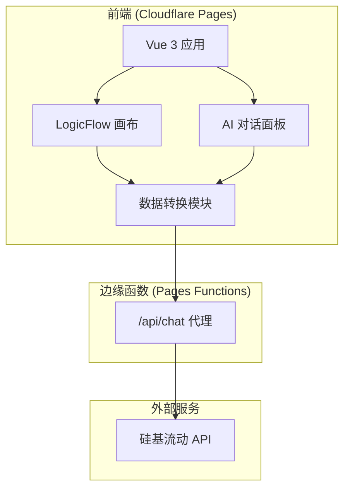

## 1. 架构设计



## 2. 技术描述

- **构建工具**：Vite 5
- **前端框架**：Vue 3 + TypeScript + Composition API (`<script setup>`)
- **图形引擎**：@logicflow/core + @logicflow/extension
- **UI 框架**：Tailwind CSS 3
- **AI 接口**：硅基流动 API（OpenAI 兼容格式）
- **部署环境**：Cloudflare Pages + Pages Functions
- **包管理器**：npm

## 3. 项目结构

```
CLD/
├── src/
│   ├── components/
│   │   ├── FlowCanvas.vue      # LogicFlow 画布组件
│   │   ├── Toolbar.vue         # 工具栏组件
│   │   └── ChatPanel.vue       # AI 对话面板组件
│   ├── composables/
│   │   └── useFlowData.ts      # 画布数据转换逻辑
│   ├── utils/
│   │   └── api.ts              # API 请求封装
│   ├── App.vue
│   ├── main.ts
│   └── style.css
├── functions/
│   └── api/
│       └── chat.ts             # Pages Functions API 代理
├── public/
├── index.html
├── package.json
├── vite.config.ts
├── tailwind.config.js
├── postcss.config.js
├── tsconfig.json
└── wrangler.toml
```

## 4. 核心数据结构

### 4.1 LogicFlow 画布数据
```typescript
interface NodeData {
  id: string;
  type: string;
  x: number;
  y: number;
  properties: {
    text: string;
  };
}

interface EdgeData {
  id: string;
  type: string;
  sourceNodeId: string;
  targetNodeId: string;
  properties: {
    polarity: '+' | '-';
  };
}

interface GraphData {
  nodes: NodeData[];
  edges: EdgeData[];
}
```

### 4.2 AI 请求格式
```typescript
interface ChatMessage {
  role: 'system' | 'user' | 'assistant';
  content: string;
}

interface ChatRequest {
  model: string;
  messages: ChatMessage[];
  stream: boolean;
}
```

## 5. 关键技术点

### 5.1 画布数据转换
将 LogicFlow 的 graphData 转换为自然语言因果链文本：
```
[当前因果回路图结构]
- 节点A --(+)--> 节点B
- 节点C --(-)--> 节点D
```

### 5.2 SSE 流式输出
使用 `fetch` + `ReadableStream` 实现流式打字机效果，解析 `text/event-stream` 响应。

### 5.3 Pages Functions 代理
- 路径：`/api/chat`
- 功能：携带 `SILICONFLOW_API_KEY` 环境变量转发请求至硅基流动 API
- 保护：API Key 不在前端暴露

### 5.4 自定义节点与连线
- 自定义矩形节点：支持双击编辑文字
- 自定义连线：根据 polarity 属性显示不同颜色和线型
